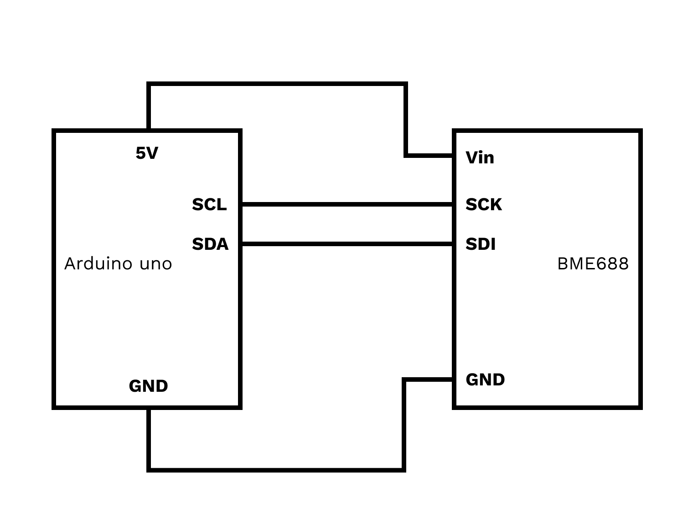
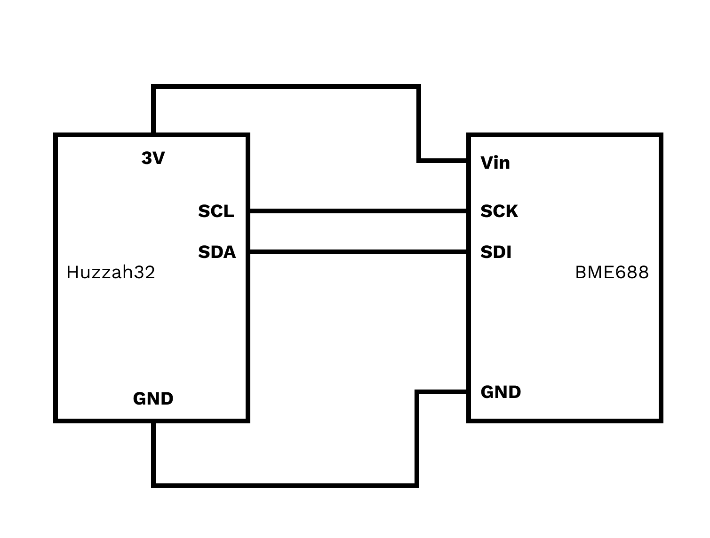

# BME688
## temperature, humidity, barometric pressure, and VOC gas

learn more in the product page: https://learn.adafruit.com/adafruit-bme680-humidity-temperature-barometic-pressure-voc-gas/arduino-wiring-test

### wiring 

#### arduino uno

#### huzzah32 

